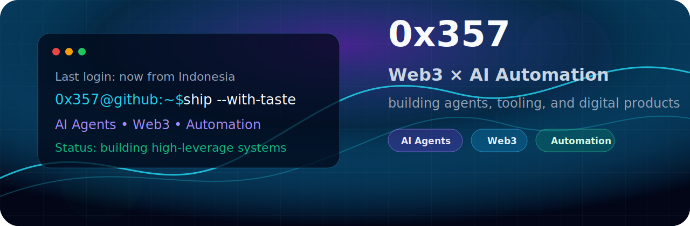
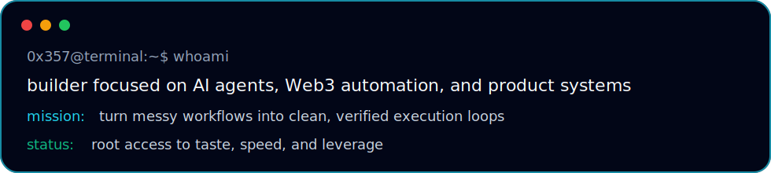

<div align="center">



<br />

<a href="https://git.io/typing-svg">
  
</a>

<br />

[](https://lynk.id/threefiveseven)
[](https://github.com/Alfianfc)
[](#)
[](#)

</div>

---



## `profile.md`

```txt
Name       : 0x357 / Alfianfc
Role       : Web3 & AI automation builder
Base       : Indonesia
Operating  : research → build → verify → ship
Interests  : AI agents, crypto ecosystems, creator tools, automation, design systems
Principle  : build fast, verify everything, ship with taste
```

## `what-i-build`

<table>
<tr>
<td width="50%" valign="top">

### ⚡ AI Agents & Automation
Workflows that can research opportunities, execute tasks, verify results, and reduce manual overhead.

</td>
<td width="50%" valign="top">

### 🧬 Web3 Tooling
Crypto-native experiments, ecosystem ops, bounty workflows, contribution pipelines, and product utilities.

</td>
</tr>
<tr>
<td width="50%" valign="top">

### 🛠️ Developer Products
Clean, pragmatic tools with maintainable architecture, useful abstractions, and fast iteration loops.

</td>
<td width="50%" valign="top">

### 🎨 Design-Forward Software
Dark, modern, high-signal interfaces with energetic accents and distinctive product identity.

</td>
</tr>
</table>

## `current-focus`

- Building an AI-assisted bounty and contribution workflow for open-source ecosystems.
- Exploring agentic systems for research, coding, content, and money ops.
- Shipping polished products around automation, media, and crypto-native communities.
- Turning scrappy ideas into usable tools with clean architecture and strong visual direction.

## `stack`

<div align="center">

### Languages & Frameworks


### Tools & Platforms


### Domains


</div>

## `selected-signal`

```bash
$ recent_activity --high-signal
> Contributing to AI evaluation / RL environment tooling
> Building automated bounty discovery + execution loops
> Designing AI-native creator and crypto tooling ideas
> Keeping products fast, visual, and useful
```

## `github-stats`

<div align="center">


<br />
<br />


</div>

## `play-zone`

<div align="center">

```txt
If you are tired, there is a mini-game below. Let the agent eat the signal.
```

<picture>
  <source media="(prefers-color-scheme: dark)" srcset="https://raw.githubusercontent.com/Alfianfc/Alfianfc/output/pacman-contribution-graph-dark.svg">
  <source media="(prefers-color-scheme: light)" srcset="https://raw.githubusercontent.com/Alfianfc/Alfianfc/output/pacman-contribution-graph.svg">
  
</picture>

</div>

## `collab`

<div align="center">

**Open to collaborations around AI agents, automation, Web3 products, and high-leverage tooling.**

<a href="https://lynk.id/threefiveseven">
  
</a>

<br />
<br />

```txt
build fast  ·  verify everything  ·  ship with taste
```

</div>
