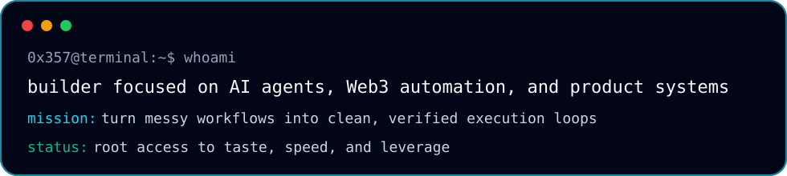

<div align="center">


<br />

<a href="https://git.io/typing-svg">
  
</a>

<br />

[](https://lynk.id/threefiveseven)
[](https://github.com/Alfianfc)
[](#)

</div>

---



## `play-zone`

<div align="center">

```txt
If you are tired, there is a mini-game below. Let the agent eat the signal.
```

<picture>
  <source media="(prefers-color-scheme: dark)" srcset="https://raw.githubusercontent.com/Alfianfc/Alfianfc/output/pacman-contribution-graph-dark.svg">
  <source media="(prefers-color-scheme: light)" srcset="https://raw.githubusercontent.com/Alfianfc/Alfianfc/output/pacman-contribution-graph.svg">
  
</picture>

</div>


## `profile.md`

```txt
Name       : Alfian
Role       : VibeCoder · Web3 Enthusiast · Design
Base       : Indonesia
Operating  : research → build → verify → ship
Interests  : teknologi, hal baru, build agent, tooling, digital product
Principle  : build fast, verify everything, ship with taste
```

## `what-i-build`

<table>
<tr>
<td width="50%" valign="top">

### ⚡ Build Agent
Workflows that can research opportunities, execute tasks, verify results, and reduce manual overhead.

</td>
<td width="50%" valign="top">

### 🧬 Web3 Enthusiast
Crypto-native experiments, ecosystem ops, bounty workflows, contribution pipelines, and product utilities.

</td>
</tr>
<tr>
<td width="50%" valign="top">

### 🛠️ Tooling
Clean, pragmatic tools with maintainable architecture, useful abstractions, and fast iteration loops.

</td>
<td width="50%" valign="top">

### 🎨 Design
Dark, modern, high-signal interfaces with energetic accents and distinctive product identity.

</td>
</tr>
</table>

## `proof-of-work`

```txt
Hermes Desktop Windows Gateway bug
- Submitted a public PR/fork patch for a Windows Gateway startup issue.
- Upstream later shipped an equivalent Gateway error fix in v0.5.4.
- Signal: bug direction validated, even though my PR itself was not merged.
```

[PR #484](https://github.com/fathah/hermes-desktop/pull/484) · [v0.5.4 release](https://github.com/fathah/hermes-desktop/releases/tag/v0.5.4)

## `collab`

<div align="center">

**Open to collaborations around AI agents, automation, Web3 products, and high-leverage tooling.**

<a href="https://lynk.id/threefiveseven">
  
</a>

<br />
<br />

```txt
build fast  ·  verify everything  ·  ship with taste
```

</div>